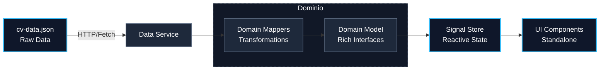
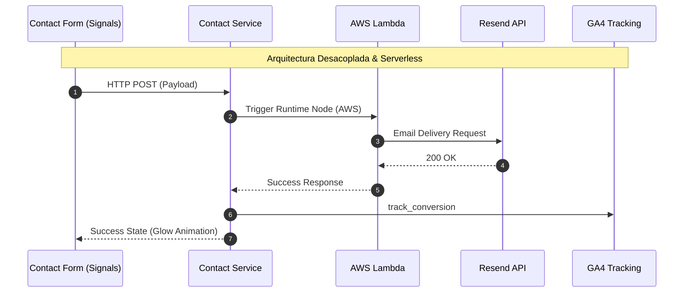

# Showcase de Arquitectura Staff - Pablo Matías Lescano

Este repositorio representa el **Gold Standard** de ingeniería frontend, auditado y certificado el 23 de marzo de 2026. Es una demostración de cómo desacoplar lógica de negocio compleja utilizando **Domain-Driven Design (DDD)** y reactividad granular con **Angular 18 Signals**.

## 🏗 Arquitectura del Sistema (DDD + Signals)

El sistema utiliza DDD para garantizar que el dominio de datos sea agnóstico a la representación visual.

### Ciclo de Vida del Dato (Contenido)



### Flujo de Contacto (Serverless Ingestion)



## 🛠 Pilares de Ingeniería

1.  **Modularidad Atómica:** Límites estrictos de 300 líneas por archivo para facilitar la mantenibilidad y testeabilidad.
2.  **SSOT (Single Source of Truth):** Sincronización absoluta entre JSON, PDF y UI.
3.  **Capa de Dominio (Mappers):** Lógica algorítmica para el cálculo de seniority (Seniority Real vs Experiencia Listada).
4.  **Resiliencia en Producción:** Gestión de assets mediante rutas absolutas y tags nativos para máxima compatibilidad con AWS Amplify.

## 🚀 Auditoría Automatizada

Para validar que cualquier cambio respete este contrato, se incluye el script `validate_contract.js`.

```bash
node validate_contract.js
```
